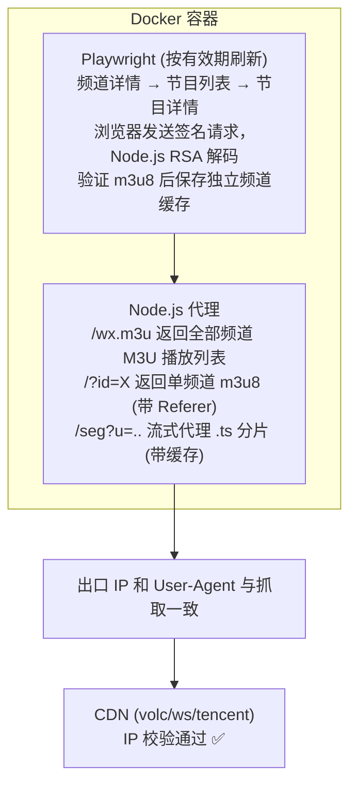

# kankanews-hls-proxy

将看看新闻(kankanews)的 HLS 直播/回看流代理出来,供 PotPlayer、VLC、hls.js 等播放器使用。

## 快速开始

```bash
# 1. 拉取镜像
docker pull ghcr.io/c0nef/kankenews-hls-proxy:latest

# 2. 启动
docker compose up -d

# 3. PotPlayer 打开
# http://<你的设备IP>:53535/wx.m3u        → 全部频道列表
# http://<你的设备IP>:53535/?id=10       → 五星体育
# http://<你的设备IP>:53535/?id=1        → 东方卫视
```

## 支持频道

| ID | 频道 |
|---|---|
| 1 | 东方卫视 |
| 2 | 新闻综合 |
| 4 | 都市频道 |
| 5 | 第一财经 |
| 9 | 哈哈炫动 |
| 10 | 五星体育 |
| 11 | 魔都眼 |
| 12 | 新纪实 |

## URL 路由

| URL | 说明 |
|---|---|
| `/wx.m3u` | 全部频道 M3U 播放列表 |
| `/?id=10` | 单频道 m3u8 直播流 |
| `/status` | JSON 状态信息 |
| `/url` | JSON 返回当前缓存状态 (默认不暴露原始 m3u8 URL) |

## 部署场景

### 1. 服务器 / NAS / 电脑

```bash
git clone https://github.com/c0nef/kankenews-hls-proxy.git
cd kankenews-hls-proxy
docker compose up -d
```

PotPlayer: `http://<设备IP>:53535/wx.m3u` (频道列表)

### 2. OpenWrt 路由器 (需安装 Docker)

```bash
opkg update && opkg install dockerd docker
service dockerd start && service dockerd enable

docker pull ghcr.io/c0nef/kankenews-hls-proxy:latest
docker run -d \
  --name kk-hls-proxy \
  --restart unless-stopped \
  -p 53535:53535 \
  -e CHANNEL_ID=10 \
  -e CHANNEL_IDS=1,2,4,5,9,10,11,12 \
  -e MAX_CACHE_SIZE=268435456 \
  --security-opt seccomp=unconfined \
  ghcr.io/c0nef/kankenews-hls-proxy:latest
```

PotPlayer: `http://192.168.1.1:53535/wx.m3u` (频道列表)

### 3. 群晖 NAS

1. **Container Manager** → **映像** → 拉取 `ghcr.io/c0nef/kankenews-hls-proxy:latest`
2. **容器** → 新建:
   - 端口: `53535` → `53535`
   - 环境变量: `CHANNEL_ID=10`
   - 环境变量: `CHANNEL_IDS=1,2,4,5,9,10,11,12`
   - 高级设置: `--security-opt seccomp=unconfined`
3. 启动

PotPlayer: `http://<NAS IP>:53535/wx.m3u` (频道列表)

## 配置

| 环境变量 | 默认值 | 说明 |
|---|---|---|
| `CHANNEL_ID` | `10` | 默认频道 ID |
| `CHANNEL_IDS` | `1,2,4,5,9,10,11,12` | 捕获频道列表,逗号分隔；只抓单频道时设为 `10` |
| `PORT` | `53535` | 容器内端口 |
| `CAPTURE_INTERVAL` | `36000000` | 最长刷新间隔 (毫秒, 默认 10 小时)；地址将在过期前 5 分钟提前刷新 |
| `ALLOWED_SEGMENT_HOSTS` | `volc-stream.kksmg.com,ws-channels.kksmg.com,tencent-stream.kksmg.com` | 允许代理的分片域名,逗号分隔 |
| `MAX_CACHE_SIZE` | `1073741824` | 最大分片缓存 (字节, 默认 1GB) |
| `MAX_CACHE_AGE` | `1800` | 缓存过期时间 (秒, 默认 30 分钟) |
| `EXPOSE_RAW_URL` | `0` | 设为 `1` 时 `/url` 返回原始 m3u8 URL |

## 工作原理

服务启动后立即监听端口，后台依次抓取全部配置频道。频道详情没有有效地址时，参考 `te.js` 的补源流程，查询当天及过去 7 天的节目列表，逐个尝试可用节目的详情地址；不会修改接口返回的节目权限字段。

直播和回看地址都会尝试，回看地址会移除 `start`、`end` 参数作为直播源使用。地址必须未过期且实际返回 HLS 清单才会写入缓存。浏览器抓取与分片代理使用相同的 User-Agent，因为当前播放令牌同时绑定出口 IP 和 User-Agent。

每 30 秒检查各频道缓存，过期前 5 分钟或达到 `CAPTURE_INTERVAL` 时刷新。失败保留旧缓存，约 60 秒后重试；多频道串行抓取时，重试会等待当前频道完成。首次抓取完成前，频道列表可能暂时显示“未捕获”。

都市频道清单中的动态 `100ycdn.com` 分片使用代理生成的签名授权，无需向 `ALLOWED_SEGMENT_HOSTS` 添加通配域名；未经签名的动态地址仍会被拒绝。

主清单、子清单及 `URI` 属性中的密钥、初始化分片地址都会经过代理改写。补源优先寻找长期有效的回看地址；找到可播放的直播地址后，最多再用约 15 秒寻找回看源，避免不可回看的频道拖延整轮抓取。



## 管理

```bash
# 查看状态
curl http://localhost:53535/status

# 查看日志
docker compose logs -f

# 手动刷新 m3u8
docker compose exec kk-proxy node src/vps-capture.js

# 手动刷新指定频道
docker compose exec -e CHANNEL_ID=4 kk-proxy node src/vps-capture.js

# 重启
docker compose restart

# 停止
docker compose down
```

## GitHub Actions (CI/CD)

推送到 `main` 或创建 tag 时自动构建 Docker 镜像:

```
ghcr.io/c0nef/kankenews-hls-proxy:latest
ghcr.io/c0nef/kankenews-hls-proxy:1.0.0
```

Fork 后使用:
1. Fork 本项目
2. **Settings → Actions → Workflow permissions** → Read and write
3. 推送代码,Actions 自动构建
4. 修改 `docker-compose.yml` 中的镜像地址

## 技术细节

详见 [docs/IMPLEMENTATION.md](docs/IMPLEMENTATION.md)

| 技术 | 实现 |
|---|---|
| API 签名 | 双 MD5 + 硬编码密钥 |
| 流地址解密 | RSA 公钥原始运算 (c^e mod n) |
| 分片代理 | 流式传输 + 异步缓存 + 唯一临时文件 |
| 缓存清理 | 每 20 次请求清理一次,防 OOM |
| 多频道 | `?id=X` 参数,每频道独立缓存 |
| 并发安全 | `crypto.randomUUID()` 临时文件 + 原子 rename |

## License

MIT License - 详见 [LICENSE](LICENSE)
