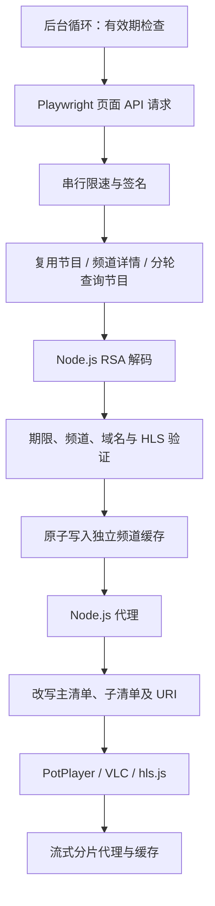

# 技术实现详解

## 项目结构

项目使用 Node.js 内置 HTTP、文件系统和加密模块实现代理，使用 Playwright Chromium 发送浏览器 API 请求。Docker 入口同时启动代理和后台抓取循环，抓取通过文件缓存向代理提供地址。服务启动不等待所有频道抓取完成。

| 模块 | 职责 |
|---|---|
| `src/vps-capture.js` | 启动浏览器、请求 API、验证 HLS 清单、原子写入频道缓存 |
| `src/signing.js` | 双 MD5 请求签名、RSA 地址解码、JWT payload 解析 |
| `src/api-queue.js` | 串行请求队列及 800 毫秒最小请求间隔 |
| `src/stream-source.js` | 选择直播/回看地址、复用取源节目、分轮扫描节目列表 |
| `src/stream-lifetime.js` | 统一识别地址到期时间、计算有效期和刷新提前量 |
| `src/capture-loop.js` | 按频道维护取源状态、定期检查缓存、失败后重试 |
| `src/cache-store.js` | 读取独立频道缓存，兼容默认频道的旧缓存路径 |
| `src/vps-server.js` | 频道列表、HLS 清单和分片代理、状态接口 |
| `src/hls-playlist.js` | 改写清单行及 `URI` 属性中的地址 |
| `src/segment-policy.js` | CDN 域名校验、动态网宿地址签名、分片缓存策略 |
| `src/healthcheck.js` | 检查默认频道是否具有仍在有效期内的地址 |

## 与本地参考脚本的对应关系

此次取源更新依据本地 `smg_fivestar.user.js` v0.23。API 版本、双 MD5 密钥和 RSA 公钥与原项目一致，API 版本为 `2.42.23`。更新主要集中在地址寿命、节目复用和请求节流。

| 参考脚本行为 | 服务端实现 |
|---|---|
| 多种 JWT 和 CDN 参数识别 | 从查询参数提取到期时间，统一保存在缓存的 `exp` 字段（秒） |
| 无到期时间的源最多缓存 20 分钟 | 后台刷新、播放接口和健康检查共用这一期限 |
| 成功取源节目记忆 30 分钟 | 每频道独立保存节目 ID；进程重启时可从近期成功缓存恢复 |
| 每轮扫描 2 个历史日期 | 失败后保留扫描位置，逐轮覆盖过去 7 天，北京时间跨日时重置 |
| 至少 800 毫秒的串行 API 队列 | 请求排队后才生成时间戳和签名，失败不会阻塞后续任务 |
| 按源寿命提前续期 | 提前量为寿命的 15%，限制在 15–120 秒 |

参考脚本中的播放器组件、页面权限标记、全屏和视频播放进度处理属于浏览器 UI 行为。服务端通过 API 返回的可用节目与实际 HLS 响应取源，保留原有八频道支持，不修改节目权限字段。

参考脚本仅供本地阅读，不是运行时或测试依赖，已在 `.gitignore` 与 `.dockerignore` 中排除。

## API 请求与地址解码

API 基址为 `https://kapi.kankanews.com`。

| API | 参数 | 用途 |
|---|---|---|
| `GET /content/pc/tv/channel/detail` | `channel_id` | 获取频道直播、回看地址 |
| `GET /content/pc/tv/programs` | `channel_id`, `date=YYYY-MM-DD` | 获取某日节目列表 |
| `GET /content/pc/tv/program/detail` | `channel_program_id` | 从节目详情的 `channel_info` 获取源地址 |

签名由业务参数、`platform=pc`、`version=2.42.23`、随机 `nonce`、秒级 `timestamp` 和 `Api-Version=v1` 组成。按参数名排序，忽略空值，拼接 `key=value&`，追加网页使用的固定签名密钥，然后计算两次 MD5。签名和参数通过请求头发送，业务参数同时放入查询字符串。

抓取先打开 `https://live.kankanews.com/huikan?id=<频道>`，随后在页面上下文内调用 `fetch`，携带本地 `uuid` 对应的 `M-Uuid` 请求头。API 请求超时为 12 秒。浏览器与代理共用 `src/http-headers.js` 的 User-Agent，CDN 请求还携带页面的 Referer 和 Origin。应让浏览器请求与后续代理请求使用同一个出口 IP。

API 的地址字段可能是明文 HTTPS 地址，也可能是 Base64 编码的 RSA 数据。加密数据按 128 字节分块，对每块执行公钥模幂运算 `c^e mod n`，验证 PKCS#1 Type 1 填充后拼接 URL。解码在 Node.js 内完成，不依赖页面上的 JSEncrypt，也不依赖播放器触发网络请求。

## 取源流程

1. 如果最近 30 分钟有成功取源的回看节目，直接重新请求该节目的详情；失败则清除记忆并继续。
2. 请求频道详情，同时收集 `shift_address` 和 `live_address`，包括 `channel_info` 内的字段。
3. 同一详情内，有明确到期时间的地址优先，再比较到期时间；有效期相同时优先回看源。不会把未知到期时间当作无限有效。
4. 若频道详情无可用源，读取当天节目。排除未来、屏蔽、删除和已标记过期的节目；优先可回看、已结束的节目，五星体育优先“体育新闻”，最后才使用当前直播节目兜底。
5. 继续扫描最多 2 个历史日期，逐个尝试候选节目；在后续抓取轮次中从下一历史日期继续，范围最多为过去 7 天。单个日期失败也会推进扫描位置。
6. 得到更合适的回看源后返回。若仅得到直播源，最多再花约 15 秒寻找更好的回看源，然后返回仍可用的直播源。

每轮取源有约 120 秒的搜索预算，到达预算后不再发起新的请求；已经发出的请求仍受自己的超时控制。扫描位置和节目记忆按频道隔离，详情中的频道 ID 不一致时拒绝该结果。进程重启会重置扫描位置。

所有候选地址必须为允许域名上的 HTTPS `.m3u8`。只删除回看窗口的 `start`、`end` 参数，保留其余签名参数。写缓存前必须通过与代理相同请求头的 HTTP 200、`#EXTM3U` 内容验证；验证超时为 10 秒，不跟随重定向。验证完成后再次检查有效期。

## 到期时间与刷新

`src/stream-lifetime.js` 是有效期判断的共同来源。

- 识别 `token` 以及其他查询参数内的 JWT `exp`；保存 JWT `iat` 用于计算源寿命。
- 识别 `volctime`、`volc_time`、`expire`、`expires`、`expiretime`、`expire_time`、`expiredtime`、`wstime`、`ws_time`、`exper`，以及参数名包含 `expire`、`expiry`、`deadline` 的时间戳，大小写不敏感。
- 时间戳支持秒和毫秒；忽略明显的时长、无关数字和超过未来 60 天的非 JWT 时间。已经过期的时间仍保留，避免旧地址被误判为没有到期时间。
- 同时存在多个期限时取最早值。读取旧缓存时也解析 URL，防止缓存中的较晚 `exp` 遮盖更早的 CDN 到期时间。
- 完全没有到期时间时，以 `capturedAt + 20 分钟` 作为保守期限。
- 播放和捕获保留 5 秒安全余量。刷新提前量按源寿命的 15% 计算，下限 15 秒、上限 120 秒；有 `iat` 时使用签发时间，否则使用抓取时间。

后台每轮结束后等待 10 秒再次检查。达到刷新期限或 `CAPTURE_INTERVAL` 时抓取，单频道两次尝试至少间隔 60 秒。各频道串行处理，因此正在执行的抓取可能延后其他频道的检查。失败保留旧文件，代理只继续使用仍在有效期内的缓存。

## 缓存与代理

频道缓存路径为 `m3u8-cache-<频道 ID>.json`，包含 `url`、`exp`、`issuedAt`、`capturedAt`、`channelId`、`source`、`sourceType`，以及节目取源时的 `programId`。只有默认频道可回退读取旧的 `m3u8-cache.json`，其他频道不会串用默认源。

抓取通过唯一临时文件写入并原子重命名，代理不会读到半写入 JSON。旧的缓存文件无需手工转换。

播放器使用 `/?id=<频道>` 请求根清单。代理把主清单、子清单、分片以及密钥、初始化分片的 `URI` 改写为 `/seg?u=...`。已配置的三个 CDN 域名直接允许；来自受信任网宿清单的动态 `*.100ycdn.com` 地址使用代理生成的签名授权，未经签名的动态地址会被拒绝。

普通分片使用流式代理，并按响应状态、大小和 Range 请求决定是否缓存。Range 响应保留 `Content-Range`；清单始终重新改写，不按普通分片缓存。

`/status` 和 `/url` 的 `hasUrl` 只表示存在缓存地址，`usable` 表示仍在有效期内。`/status` 还返回 `effectiveExp` 和 `secondsLeft`，包含未知到期时间源的保守期限。健康检查要求默认频道同时满足 `hasUrl` 和 `usable`。`/url` 默认不暴露原始 URL，只有 `EXPOSE_RAW_URL=1` 时返回。

## 数据流



## 验证

```bash
npm ci
npm test
bash -n docker-entrypoint.sh
```

测试覆盖多种有效期格式、短期和未知期限源、节目记忆与分轮扫描、频道隔离、API 排队、失败重试，以及真实本地 HTTP 代理的状态、播放过期判断和健康检查。测试使用合成地址与本地服务，不需要参考脚本、浏览器安装或真实上游访问。
